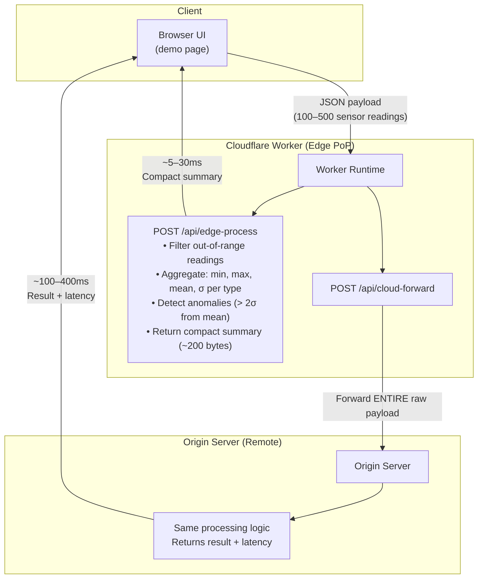

# Edge Computing Demo — Edge Processing vs Cloud Round-Trip

> Paper: Shi et al., "Edge Computing: Vision and Challenges" (IEEE IoT Journal, 2016)  
> Tool: [Cloudflare Workers](https://developers.cloudflare.com/workers)

## What This Demo Demonstrates

This demo implements the **cloud offloading** case study from Shi et al. (2016, Section III-A), showing side-by-side the difference between:

| Path | Description | Paper Concept |
|------|-------------|---------------|
| **Edge Processing** | IoT sensor data processed at the nearest Cloudflare PoP — compact summary returned | Cloud offloading: cache the **operation** at the edge |
| **Cloud Round-Trip** | Raw data forwarded to remote origin server → processed there → result returned | Traditional centralized cloud model |

### What We Measure

- ⏱ **Response latency** — edge processing vs. cloud round-trip
- 📊 **Data size reduction** — raw readings vs. aggregated summary
- 📡 **Bandwidth saved** — percentage of data that never leaves the edge
- 🏷 **Serving location** — which Cloudflare PoP handled the request

### Paper Connection

> "Edge computing refers to the enabling technologies allowing computation to be performed at the edge of the network." — Shi et al., 2016

The demo directly addresses two of the paper's six challenges:

1. **Cloud Offloading (Section III-A)** — The Worker caches the *operation* (filter, aggregate, anomaly detect) at the edge, not just data
2. **Optimization Metrics (Section III-F)** — Latency AND bandwidth are co-optimized simultaneously

## Architecture



## Prerequisites

- **Bun** ≥ 1.x (includes Bun runtime and package manager)
- **Wrangler CLI** (installed as dev dependency, or globally via `bun add -g wrangler`)
- A Cloudflare account (free tier is sufficient — only needed for deployment, not local dev)

## Quick Start (Local Development)

### 1. Install dependencies

```bash
# Worker dependencies
cd demo/worker
bun install

# Origin server dependencies
cd ../origin-server
bun install
```

### 2. Start the origin server (simulated cloud)

```bash
cd demo/origin-server
bun server.js
# → Listening on port 3001
# → Simulated latency: 50ms (configurable via SIMULATED_LATENCY_MS env var)
```

### 3. Start the Worker (edge)

In a separate terminal:

```bash
cd demo/worker
bunx wrangler dev
# → Worker running at http://localhost:8787
```

### 4. Open the demo UI

Navigate to **http://localhost:8787** in your browser.

1. Click **"⚡ Generate IoT Data"** to create sensor readings
2. Click **"🚀 Run Comparison"** to process the same data via both paths
3. Observe the latency, bandwidth, and anomaly detection differences

## Deploy to Cloudflare (Live Demo)

For a live presentation, deploy the Worker to Cloudflare's global network:

### 1. Deploy the origin server

Deploy `origin-server/server.js` to any Bun/Node.js hosting platform (e.g., Railway, Render, Fly.io). Note the public URL.

### 2. Update the Worker's origin URL

Edit `worker/wrangler.jsonc` and set `ORIGIN_URL` to your deployed origin server:

```jsonc
{
  "vars": {
    "ORIGIN_URL": "https://your-origin-server.example.com"
  }
}
```

### 3. Login and deploy

```bash
cd demo/worker
bunx wrangler login      # Authenticate with Cloudflare (one-time)
bunx wrangler deploy     # Deploy to 300+ edge locations worldwide
```

The Worker URL will be printed — open it in a browser to run the demo.

## Configuration

### Origin Server

| Environment Variable | Default | Description |
|---------------------|---------|-------------|
| `PORT` | `3001` | Listening port |
| `SIMULATED_LATENCY_MS` | `50` | Artificial delay (ms) to simulate data center processing latency |

### Worker

| Variable (wrangler.jsonc) | Default | Description |
|--------------------------|---------|-------------|
| `ORIGIN_URL` | `http://localhost:3001` | URL of the origin server |

## Expected Results & Talking Points

### Latency

- **Edge processing**: ~5–30 ms (Worker processes locally)
- **Cloud round-trip**: ~100–400 ms (network round-trip to origin)
- **Speedup**: 5–15× improvement

### Bandwidth

- **Raw payload**: ~2–15 KB (100–500 sensor readings)
- **Processed summary**: ~200–500 bytes
- **Reduction**: ~90% of data never leaves the edge

### Demo Narrative for Presentation

1. **"Generate IoT Data"** → "We're simulating 100 sensor readings from an industrial facility — temperature, humidity, pressure, vibration sensors."
2. **"Run Comparison"** → "The same data goes to both endpoints simultaneously. The edge path processes here in [city]. The cloud path sends all raw data to a remote server."
3. **Results** → "Edge processing was X times faster and reduced data transfer by Y%. At scale with millions of sensors, those bandwidth savings dominate."
4. **Paper connection** → "This is exactly Shi et al.'s cloud offloading case study: we cached the *operation* at the edge, not just the data. Both latency and bandwidth are co-optimized — the paper's optimization metrics challenge."

### Fallback Behavior

If the origin server is unreachable, the cloud path automatically falls back to simulated cloud processing (150ms delay + local processing). This ensures the demo works even without the origin server running.

## References

1. W. Shi, J. Cao, Q. Zhang, Y. Li, and L. Xu, "Edge Computing: Vision and Challenges," *IEEE Internet of Things Journal*, vol. 3, no. 5, pp. 637–646, Oct. 2016.
2. Cloudflare, "How Workers Works," [Cloudflare Docs](https://developers.cloudflare.com/workers/reference/how-workers-works/), 2026.
